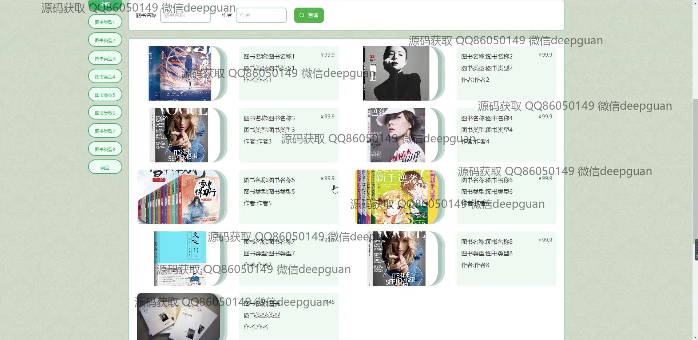
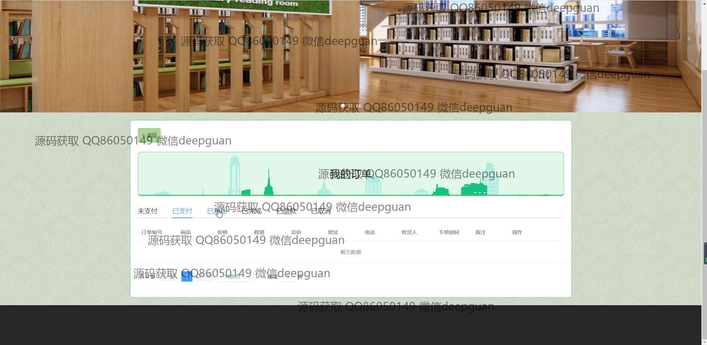

<h1 align="center">图书在线商城的设计与实现</h1>

## 简介
在线图书商城系统：角色分为管理员、用户、商家；主要功能包括用户登录注册、图书管理、订单管理、留言板、个人中心、购物车等，支持在线支付和个性化服务，旨在提升用户购物体验。    --计算机毕业设计源码；毕设源码；java毕业设计源码

## 联系方式

<h3 align="center">获取完整代码与数据库文件 + 微信：deepguan QQ: 86050149 QQ群: 783742310</h3>

<h3 align="center">可帮忙远程部署 包运行成功！提供远程部署、修改代码、设计文档指导、代码讲解等服务！</h3>

## 功能介绍（完整见运行截图）
管理员：拥有管理整个图书商城系统的权限，包括图书、用户和商家的管理功能。可以通过导航菜单访问首页、个人中心、用户管理、商家管理、图书分类管理、留言板等模块，实现对后台所有数据的增删改查操作。同时负责公告信息的编辑和发布，管理订单和处理用户反馈。提供全面的书籍信息管理功能，包括新建、修改、查看评论和删除书籍等操作，以及生成和查看订单报表，掌握系统运行情况。

用户：注册和登录后可以浏览和购买书籍，通过个人中心管理个人信息、查看订单历史、修改收货地址等。支持购物车功能，用户可以添加商品至购物车并进行结算。同时可以在留言板上发布留言或进行用户交流和讨论。浏览功能包括按书籍分类、作者或关键字进行搜索查看，查看书籍详细信息和用户评价，方便购买前的决策。用户还可以收藏喜爱书籍，查看积分和余额信息，参与平台交互。

商家：拥有注册及登录特定模块的权限，主要负责其店铺中商品的信息管理。商家可以通过管理后台增加新书、更新库存、修改或者删除上架产品等操作。订单管理模块允许商家处理用户订单，查看订单详情和处理方式，包括发货、取消和退款等。商家需确保图书信息准确，定期维护商品列表，并使用平台提供的交流工具与用户沟通。平台为商家提供了清晰的操作界面，简化日常管理流程。

访客：无需注册和登录即可访问一些公共功能，如浏览网站首页、查看推荐书籍和平台政策介绍。访客可以了解商城的主要功能模块及其布局设计，但无法进行购买、收藏、添加购物车或查看具体商品详情等操作。为了得到完整的访问权限，访客可以选择通过注册成为正式用户。平台的设计确保访客能轻松了解商城的功能特点，并为后续的注册转化提供便利的操作指引。

## 运行截图

本代码来源于网络,仅供学习参考使用!

